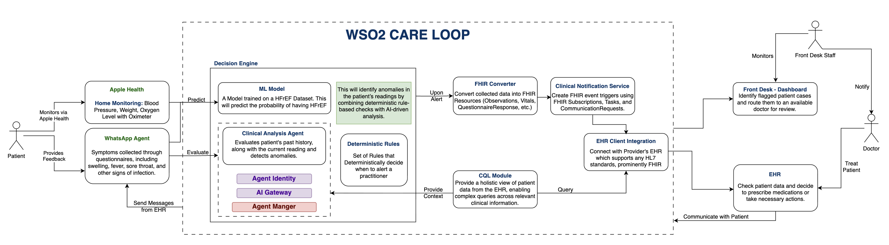

# WSO2 Care Loop

An AI-assisted care loop connecting remote patients with a heart clinic, built
for the HL7 AI competition. Patient-side home monitoring and messaging feed an
agent-driven engine that converts incoming data to FHIR, predicts risk, and
routes clinical notifications and telehealth back to the care team. Integrations
run on Ballerina.

## Architecture



Earlier stages: [v1](assets/architecture-diagram-v1.png),
[whiteboard sketch](assets/whiteboard-sketch.png).

## Components

- [apple-healthkit-simulator](apple-healthkit-simulator/) — FastAPI service that
  ingests Apple HealthKit samples for multiple patients (port 8000). Also runs
  an in-process hourly job (`src/app/vitals_forwarder.py`) that builds a FHIR
  `Observation` bundle from each patient's last-hour vitals and forwards it to
  `HEALTHKIT_VITALS_TARGET_URL` (unset by default — no downstream consumer
  exists yet, so the job just builds the bundle and skips the POST). Manually
  trigger a cycle with `POST /vitals-cron/run-now`, check the last result with
  `GET /vitals-cron/status`.
- [whatsapp-simulator](whatsapp-simulator/) — Next.js chat UI that renders a
  pushed questionnaire and posts the conversation transcript to a callback URL
  (port 3000).
- ehr-fhir-server — WSO2 FHIR R4 server (`wso2/fhir-server`, Go + Postgres)
  standing in for the clinic's EHR/EMR FHIR API. Port 9090 (`/fhir/r4`). Has no
  auth of its own; fine for this local demo, put a gateway/auth proxy in front
  for anything real.
- care-loop-fhir-server — HAPI FHIR server (`hapiproject/hapi`), the Care
  Loop's own internal FHIR store, port 9091 (`/fhir`). Kept in sync from
  ehr-fhir-server by fhir-sync; this is what fhir-mcp-server actually reads
  from.
- fhir-sync — Bun script (`scripts/sync/`) that mirrors every resource from
  ehr-fhir-server into care-loop-fhir-server every hour, `PUT`-ing each one
  under its original EHR id so references need no remapping.
- fhir-mcp-server — WSO2 FHIR R4 to MCP bridge (`wso2/fhir-mcp-server`) in
  front of care-loop-fhir-server, exposing the FHIR API as MCP tools on port
  8001. Reaches it through care-loop-fhir-server-readonly-proxy (nginx), which
  403s anything but GET/HEAD, so the bridge can only read.
- [care-loop-ai-service](care-loop-ai-service/) — standalone Ballerina agent
  (port 8003). `POST /questionnaires` with a `patientId` runs an `ai:Agent`
  wired to fhir-mcp-server (via `ai:McpToolKit`), which calls the MCP `search`
  tool itself to pull that patient's recent Observations, then drafts a FHIR
  `Questionnaire` (questions only, no answers) targeted at the vitals trend.
  Not wired into the rest of the loop yet — this is a standalone component
  for now. Uses `ballerina/ai`'s built-in `Wso2ModelProvider` (via
  `ai:getDefaultModelProvider()`), configured through the `wso2ProviderConfig`
  table in `Config.toml` (copy `Config.toml.example`); gitignored, never
  commit it. See `TODO.md` for the WSO2 Agent Manager registration this is
  deferred on.

- [care-loop-collector-service](care-loop-collector-service/) — standalone
  Ballerina bridge (port 8004). `POST /generate` fetches every `Patient` from
  care-loop-fhir-server, asks care-loop-ai-service to draft a Questionnaire
  per patient, converts each into whatsapp-simulator's chat shape, and opens
  one chat session per patient there. `POST /transcripts` is the callback
  each session posts its completed answers to; it builds a FHIR
  `QuestionnaireResponse` from them and saves it back to
  care-loop-fhir-server. Triggered from the "Generate Questionnaires" button
  on whatsapp-simulator's home page, which also lists every chat this
  produces. Needs a `Config.toml` (copy `Config.toml.example`); gitignored.

Run the stack with `make up`, or `make watch` to run it in the foreground and
rebuild on change.

### Seeding demo data

`make up` also runs `make seed`, which runs `scripts/seed/index.ts` (Bun):
loads the three demo patients in `scripts/seed/data/patients.json` (one
stable, one borderline, one at-risk) into apple-healthkit-simulator's own
REST API and into ehr-fhir-server as FHIR `Patient`/`Encounter`/`Condition`/
`AllergyIntolerance`/`MedicationRequest`/`Observation` resources, then seeds
the next 24 hours of hourly vitals (heart rate, SpO2, respiratory rate, blood
pressure) per patient into apple-healthkit-simulator only, timestamped into
the future from "now". apple-healthkit-simulator's `Patient.fhir_patient_id`
column (set via `PATCH /patients/{uuid}/fhir-link`) links the two systems'
patient records. `make seed` also restarts fhir-sync, which mirrors this data
into care-loop-fhir-server on startup and then hourly after that.

apple-healthkit-simulator's hourly job picks up each hour's worth of readings
as real time reaches them, ready to forward once `HEALTHKIT_VITALS_TARGET_URL`
points at a real consumer.

## Logging

apple-healthkit-simulator and care-loop-heart-risk-service log via
[loguru](https://github.com/Delgan/loguru) (`from loguru import logger`) to
stdout. whatsapp-simulator logs via `consola` (`src/lib/logger.ts`).
front-desk-dashboard has no server-side code, so nothing to log.

## Pre-commit hooks

ruff (apple-healthkit-simulator), biome plus knip (whatsapp-simulator), and
`bal format` plus `bal scan` (care-loop-ai-service) run on staged files at
commit time. The config lives at `hl7-ai-competition/.pre-commit-config.yaml`;
install the hook pointing at it once, from the fork root (needs
`pre-commit`, e.g. `uv tool install pre-commit`; the whatsapp-simulator hooks
also need `bun`, care-loop-ai-service needs `bal`):

```sh
pre-commit install -c hl7-ai-competition/.pre-commit-config.yaml
```
