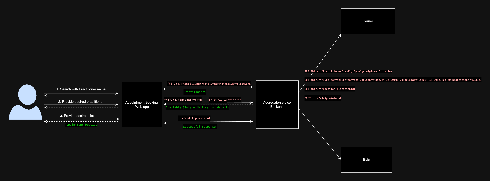

# Use case: Schedule an Appointment

In today’s healthcare ecosystem, practitioner information, including their schedules and available appointment slots, is often distributed across multiple Electronic Medical Record (EMR) systems. This use case outlines how appointment scheduling can be efficiently handled by aggregating data from Cerner. This allows patients to seamlessly search for healthcare practitioners, view available time slots, and book appointments—all from a single platform.

## The Scenario Overview
### Day-to-Day Scenario - Patient’s Journey

**Morning Health Concern:** 
Glen, a 45-year-old, experiences mild chest pain in the morning. Concerned, he decides to book an appointment with the well-known cardiologist Dr. Christina Applegate. Instead of calling different hospitals to find the availability of the doctor, Glen opens the Channeling web app in the Browser. 

**Log In:** 
Glen logs into the web app with his username and password. The app authenticates him using an integrated identity access management (IAM) system, providing a secure session.

**Searching for a Practitioner:** 
Glen enters ‘Dr. Christina Applegate’ in the app’s search bar. The app sends this search request to the backend system (Aggregate-backend), which aggregates data from multiple EMR Systems.
Reviewing Doctor’s Availability: Within seconds, the app returns a list of Dr. Christina Applegate's available sessions at different locations. 

**Choosing a Time Slot:** 
Glen sees that Dr. Christina Applegate has an opening at CDEM Colombo on October 10th, 2024, from 4:00 PM to 4:30 PM. Since this time slot is convenient for him, he selects it.

**Booking the Appointment:** 
Glen confirms his selection, and the app creates an appointment by sending a request to the Aggregate-backend. This request is forwarded to the relevant EMR system to reserve the slot. The system marks the chosen slot as busy, ensuring no one else can book it.

**Appointment Confirmation:** 
Shortly after, Glen receives a confirmation notification within the web app, stating that his appointment with Dr. Christina Applegate is scheduled at CDEM Colombo. The appointment details include the time, date, location, and the doctor's name.

**Peace of Mind:**
Glen feels reassured knowing he has an appointment with a cardiologist. He goes about his day, confident that he will soon receive medical care.

## Running the App
1. Setup and run the [Aggregate-Backend](aggregate-service/Readme.md)
1. Navigate to the directory, 'Davinci_Coverage_Demo_app'
2. Execute the following command. 
```
npm run dev
```
3. Navigate to http://localhost:5173 in your web browser. 
4. Select the patient from the dropdown. 
5. Once the patient is selected and clik on 'Treat Patient', you will be navigated to http://localhost:5173/dashboard
6. Click on 'Book an Appointment'
7. Search for a doctor using doctor's first and last name. Provide 'Christina' as the first name and 'Applegate' as the last name and click on 'Search Doctor' button. Then you can continue the scenario. 


## Behind the Scenes - Healthcare Provider’s Perspective



1. Doctor Search Request (Web App → Aggregate Backend API)

    - The user, Glen, enters the doctor's first and last name (e.g., "Christina Applegate") in the search bar of the web app.
    The app sends a search request to the Aggregate Backend API, which forwards the request to multiple connected EMR systems, querying each EMR's FHIR-compliant API to find matching practitioners.

   -  Example query:
        ``` 
        GET Practitioner?given=Christina&family=Applegate
        ```
    - Each EMR system responds with relevant practitioner details, such as name and unique practitioner ID.
    The web app displays a list of matching doctors (if multiple exist) to Glen, allowing him to select the intended practitioner.

2. Fetching Doctor’s Availability (Web App → Aggregate Backend API → EMR Systems):

    - After selecting Dr. Christina Applegate from the search results, Glen chooses a desired appointment date and clicks "Check Availability."
    - The web app sends this request to the Aggregate Backend API with the selected date and practitioner ID.
    - The Aggregate Backend API constructs and sends a FHIR-compliant Slot query to each EMR system for the selected date, requesting available slots for Dr. Applegate.
    - Example query: 
        ```
        GET Slot?serviceType=consultation&start=ge2024-11-10T06:00:00&start=lt2024-11-10T23:00:00&practitioner={practitionerId}
        ```
    - Each EMR system returns a list of available time slots, including location details.
    - The Aggregate Backend consolidates the responses from multiple EMR systems and returns a unified list of available time slots to the web app.
    - The web app displays these slots to Glen in a user-friendly format.

3. Displaying Available Slots (Web App)

    - Glen sees a list of available time slots for Dr. Christina Applegate, along with the respective location details.
    - Each slot card displays the start time, end time, and location, allowing Glen to easily view and select his preferred slot.

4. Selecting a Time Slot and Appointment Creation (Web App → Aggregate Backend API → EMR System):
    - Glen selects a specific time slot (e.g., 4:00 PM to 4:30 PM at "Model Hospital").
    - The app packages this selection as a JSON FHIR Appointment payload, including:
        ```
        Start Time and End Time: Selected appointment time
        Location Reference: Hospital or clinic location
        Patient Reference: Glen’s patient ID
        Slot Reference: Selected slot ID
        ```
    - The app sends this JSON payload to the Aggregate Backend API, which forwards it to the appropriate EMR system to create the appointment.

5. Appointment Confirmation (EMR System → Aggregate Backend API → Web App)
    - The EMR system processes the appointment request, verifies slot availability, and confirms the booking by returning a successful status.
    - The Aggregate Backend API relays this confirmation to the web app, which displays a success message to Glen.
    - Glen receives an appointment receipt, confirming his scheduled session with Dr. Christina Applegate, including all relevant details (date, time, location).


