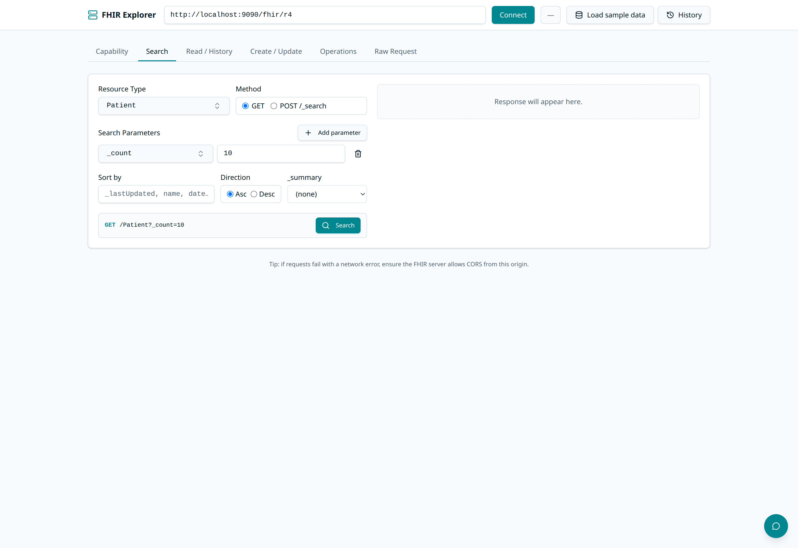

# FHIR Explorer

FHIR Explorer is a Next.js application for browsing FHIR R4 servers and asking
read-only questions about their data through the FHIR MCP server.



## Prerequisites

- Node.js 22 or later
- pnpm 11 or later
- A reachable FHIR R4 server
- An OpenAI-compatible API key for the assistant

## Setup

```bash
pnpm install
cp .env.example .env.local
```

Set `OPENAI_API_KEY` in `.env.local`. Set `OPENAI_BASE_URL` when using an
OpenAI-compatible gateway instead of the default OpenAI endpoint.

Start the development server:

```bash
pnpm dev
```

Open `http://localhost:3000` in a browser.

## Configure A FHIR Server

Enter the FHIR server's base URL in the application. For local development,
`http://localhost:9090` and `http://127.0.0.1:9090` are allowed by default.

To allow additional origins, set a comma-separated list in `.env.local`:

```dotenv
FHIR_ALLOWED_ORIGINS=https://fhir.example.com,https://fhir-test.example.com
```

To preconfigure the server selected for new browser sessions, set:

```dotenv
FHIR_DEFAULT_BASE_URL=https://fhir.example.com
```

The server validates user-supplied URLs and rejects private or internal network
addresses unless their origins are explicitly allowlisted.

## Commands

```bash
pnpm dev       # Start the development server
pnpm build     # Create a production build
pnpm start     # Start the production server
pnpm lint      # Run ESLint
pnpm test      # Run the test suite
```
