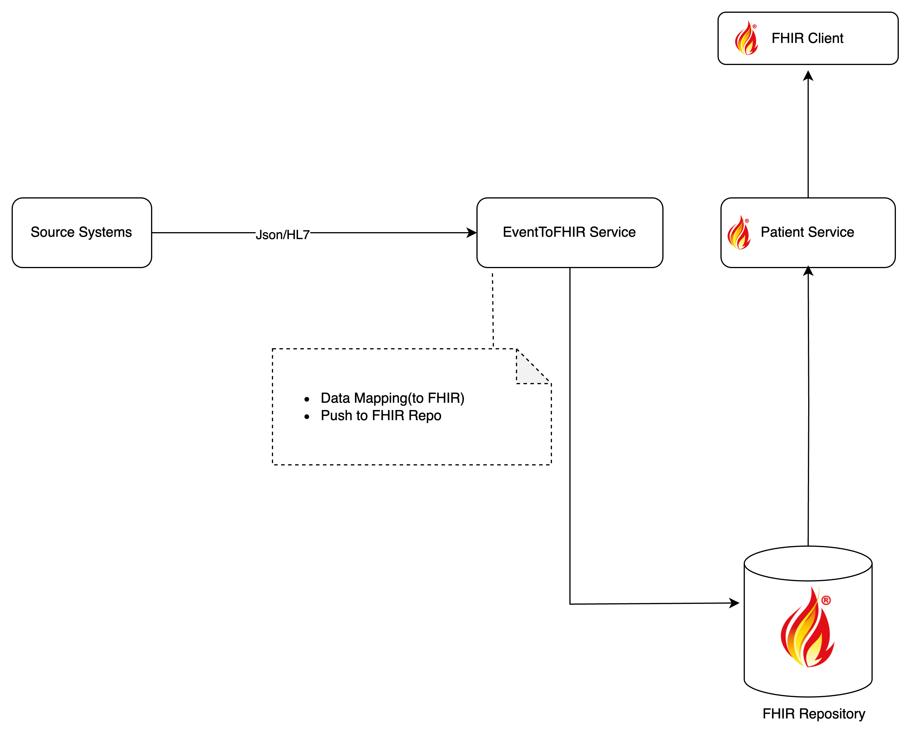

# Health Data Access Demo

This project demonstrates a complete setup for integrating custom health data with FHIR standards and exposing patient data through FHIR-compliant APIs. The architecture leverages WSO2 Healthcare solution and a FHIR Repository to enable real-time health data interoperability and access.

## Overview  

### Components  
1. **Mock Source System**  
   - Simulates the source of custom health data.  

2. **[Event2FHIR API](./event-to-fhir-service/README.md)**  
   - Converts incoming custom health data into FHIR-compliant resources.  
   - Persists the FHIR resources in a FHIR Repository.  

3. **[Patient FHIR API](./patient-service/README.md)**  
   - Provides access to patient data in standard FHIR format.  

4. **FHIR Repository**  
   - Central storage for FHIR-compliant resources.  
   - Supports syncing and retrieval of health data.  