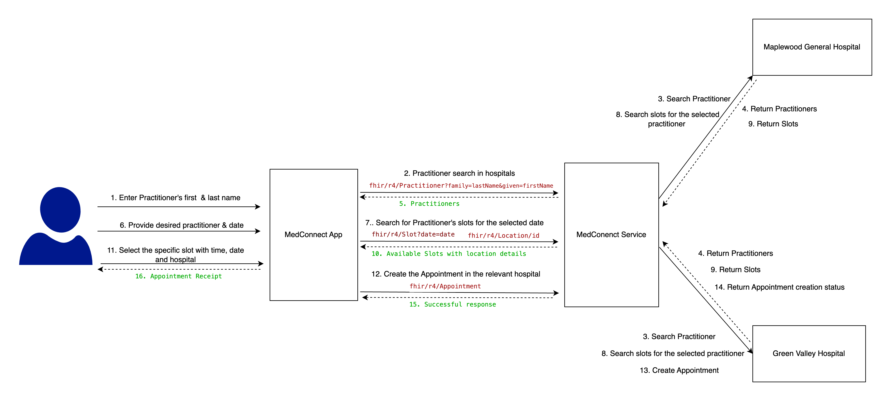

# Use case: Schedule an Appointment

In today’s healthcare ecosystem, practitioner information, including their schedules and available appointment slots, is often distributed across multiple Electronic Medical Record (EMR) systems. This use case outlines how appointment scheduling can be efficiently handled by aggregating data from multiple EMR systems. This allows patients to seamlessly search for healthcare practitioners, view available time slots, and book appointments—all from a single platform.

## The Scenario Overview
### Day-to-Day Scenario - Patient’s Journey

**Morning Health Concern:** 
Glen, a 45-year-old, experiences mild chest pain in the morning. Concerned, he decides to book an appointment with the well-known cardiologist Dr. Christina Applegate. Instead of calling different hospitals to find the availability of the doctor, Glen opens the MedConnect web app in the Browser. 

**Log In:** 
Glen logs into the MedConnect web app with his username and password. The app authenticates him using an integrated Identity Access Management (IAM) system, providing a secure session.

**Searching for a Practitioner:** 
Glen searches for the doctor using the first name and last name, and the app returns a list of matching practitioners based on the search query. Glen selects the practitioner as Dr. Christina Applegate and March 10th, 2025 as the desired date for the appointment. 

**Reviewing Doctor’s Availability:**
Within seconds, the app returns a list of Dr. Christina Applegate's available sessions at different locations. 

**Choosing a Time Slot:** 
Glen sees that Dr. Christina Applegate has an opening at Maplewood Hospital on March 10th, 2025, from 4:00 PM to 4:30 PM. Since this time slot is convenient for him, he selects it.

**Booking the Appointment:**
Glen confirms his selection, and the app creates an appointment by sending a request to the MedConnect service. This request is forwarded to Maplewood Hospital’s EMR system to reserve the slot. The system marks the chosen slot as busy, ensuring no one else can book it.

**Appointment Confirmation:** 
Shortly after, Glen receives a confirmation notification within the MedConnect app, stating that his appointment with Dr. Christina Applegate is scheduled at Maplewood Hospital. The appointment details include the time, date, location, and the doctor's name.

**Peace of Mind:** 
Glen feels reassured knowing he has an appointment with a cardiologist. He goes about his day, confident that he will soon receive medical care.


## Running the App
1. Setup and run the [Medconnect-Service](./medconnect-service/README.md)
2. Add the url configuration details to the <SOLUTIONS-HEALTHCARE-DEMOS>/apps/demo-ehr-app/src/config/urlConfig.ts file. (Currently the medconnect service is deployed in Choreo. You can update these values to match your local environment or any other deployment setup as needed.)
3. Navigate to the directory, <SOLUTIONS-HEALTHCARE-DEMOS>/apps/demo-ehr-app
4. Execute the following command. 
```
npm run dev
```
5. Navigate to http://localhost:5173 in your web browser. 
6. Select the patient from the dropdown. 
7. Once the patient is selected and clik on 'Treat Patient', you will be navigated to http://localhost:5173/dashboard
8. Click on 'Book an Appointment'
9. Search for a doctor using doctor's first and last name. Provide 'Christina' as the first name and 'Applegate' as the last name and click on 'Search Doctor' button. Then you can continue the scenario. 


## Behind the Scenes - Healthcare Provider’s Perspective



1. Doctor Search Request (MedConnect Web App → MedConnect Service API)

    - The user, Glen, enters the doctor's first and last name (Christina Applegate) in the search bar of the MedConnect app.
    - The app sends a search request to the MedConnect Service, which forwards the request to multiple connected EMR systems, querying each EMR's FHIR-compliant API to find matching practitioners.
        
        Example query: 
        ```
        GET “<base_url>/Practitioner?given=Christina&family=Applegate”
        ```
    - Each EMR system responds with relevant practitioner details, such as name and unique practitioner ID.
    - The MedConnect app displays a list of matching doctors (if multiple exist) to Glen, allowing him to select the intended practitioner.


2. Fetching Doctor’s Availability (MedConnect App → MedConnect service → Hospitals):

    - After selecting Dr. Christina Applegate from the search results, Glen chooses a desired appointment date and clicks "Check Availability."
    - The web app sends this request to the MedConnect service with the selected date and practitioner ID.
    - The MedConnect service constructs and sends a FHIR-compliant Slot query to each EMR system for the selected date, requesting available slots for Dr. Applegate.
        ```
        GET “<base_url>/Slot?serviceType={SERVICE_TYPE}&start=ge2025-01-25T06:00:00&start=lt2025-01-25T23:00:00&practitioner={practitionerId}”
        ```
    - Each EMR system returns a list of available time slots, including location details.
    - The MedConnect service consolidates the responses from multiple EMR systems and returns a unified list of available time slots to the MedConnect app.
    - The MedConnect app displays all of these slots to Glen in a user-friendly format.


3. Displaying Available Slots (MedConnect Web App)

   - Glen sees a list of available time slots for Dr. Christina Applegate, along with the respective location details.
- Each slot card displays the start time, end time, and location, allowing Glen to easily view and select his preferred slot.


4. Selecting a Time Slot and Appointment Creation (MedConnect App → MedConnect service→ Hospitals)
    - Glen selects a specific time slot (eg:  4:00 PM to 4:30 PM at "Maplewood Hospital").
    - The app packages this selection as a JSON FHIR Appointment payload, including:
        - Start Time and End Time: Selected appointment time
        - Location Reference: Hospital or clinic location
        - Patient Reference: Glen’s patient ID
        - Slot Reference: Selected slot ID
    - The app sends this JSON payload to the MedConnect service, which forwards it to the appropriate hospital’s EMR system to create the appointment.


5. Appointment Confirmation (Hospital → MedConnect service → MedConnect App)
    - The hospital’s EMR system processes the appointment request, verifies slot availability, and confirms the booking by returning a successful status.
    - The MedConnect service relays this confirmation to the MedConnect app, which displays a success message.
    - Glen receives an appointment receipt, confirming his scheduled session with Dr. Christina Applegate, including all relevant details (date, time, location).

Note that this implementation can be integrated with an IAM System to authenticate end-users as well, but currently we have not integrated that. 
